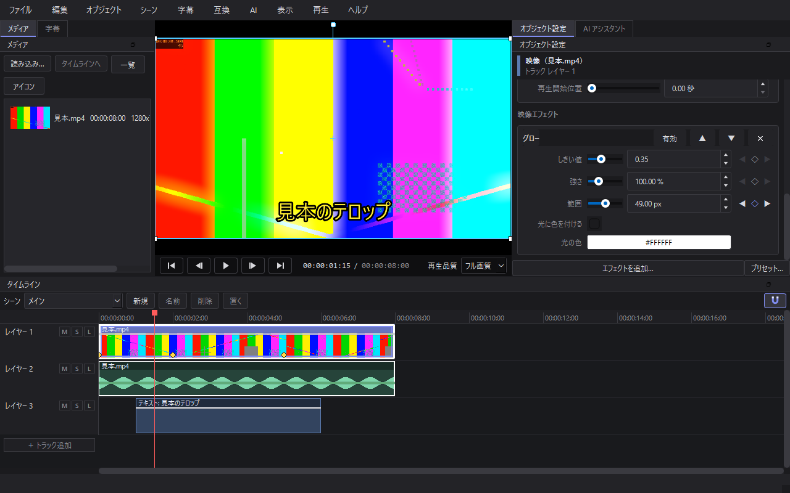
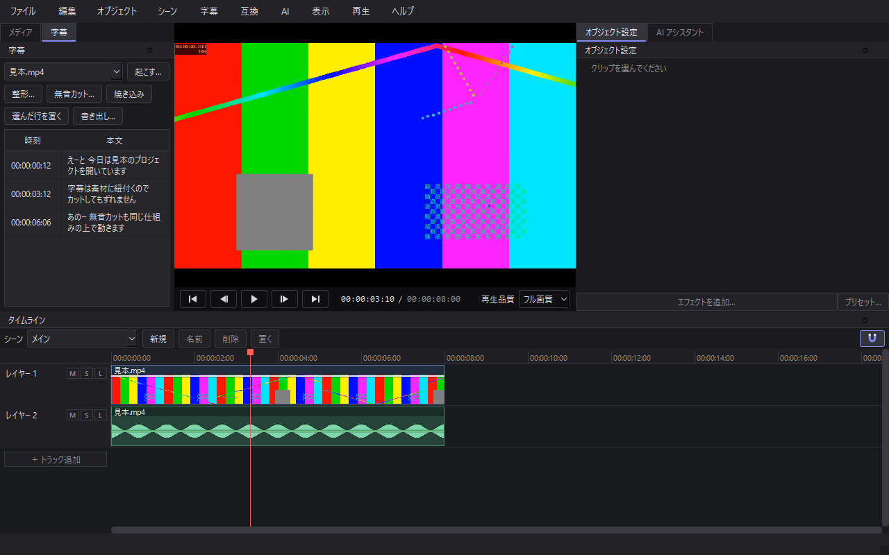
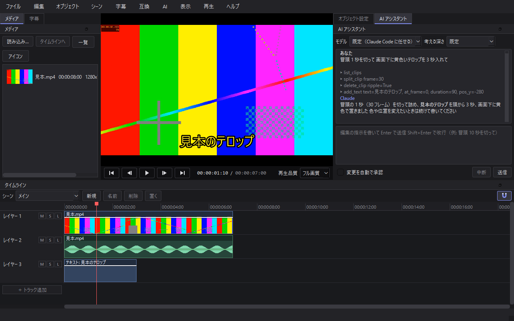
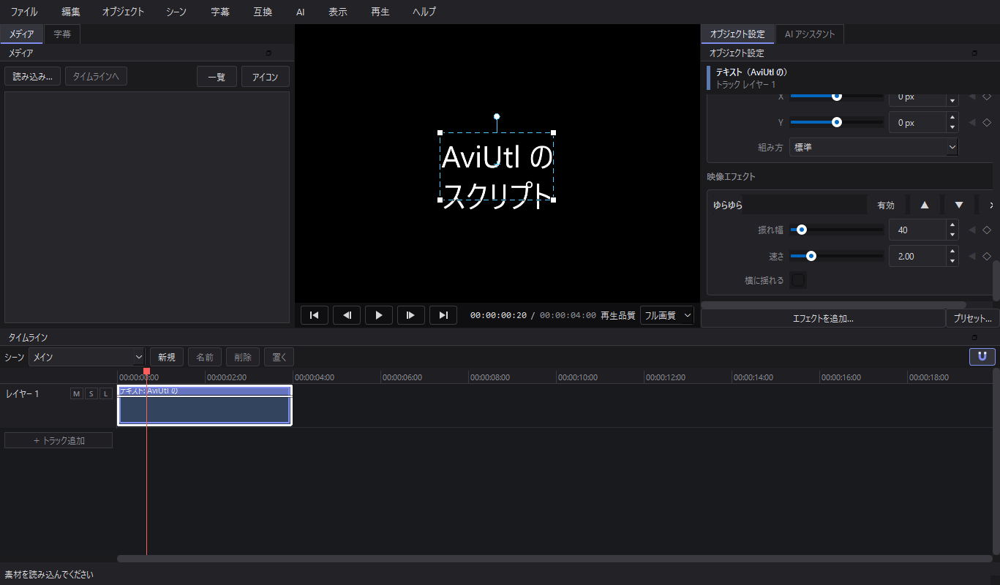
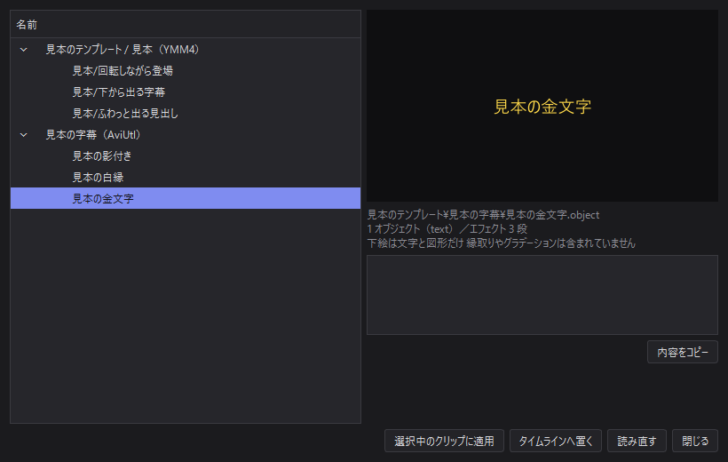
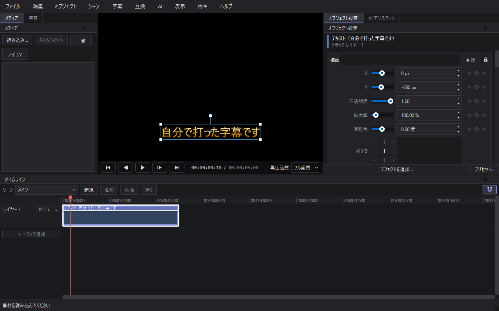
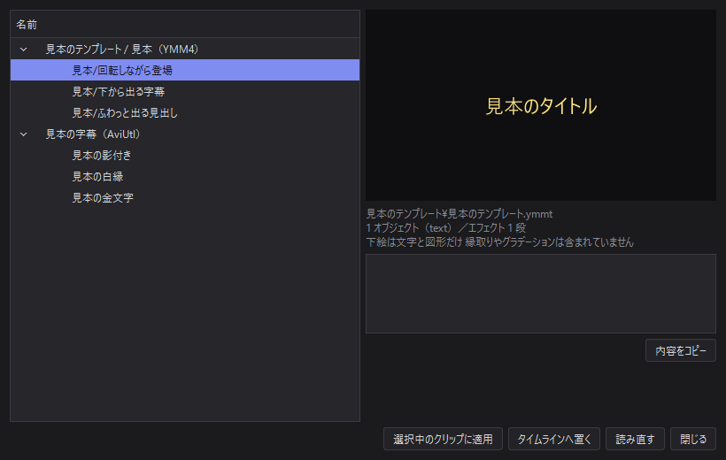
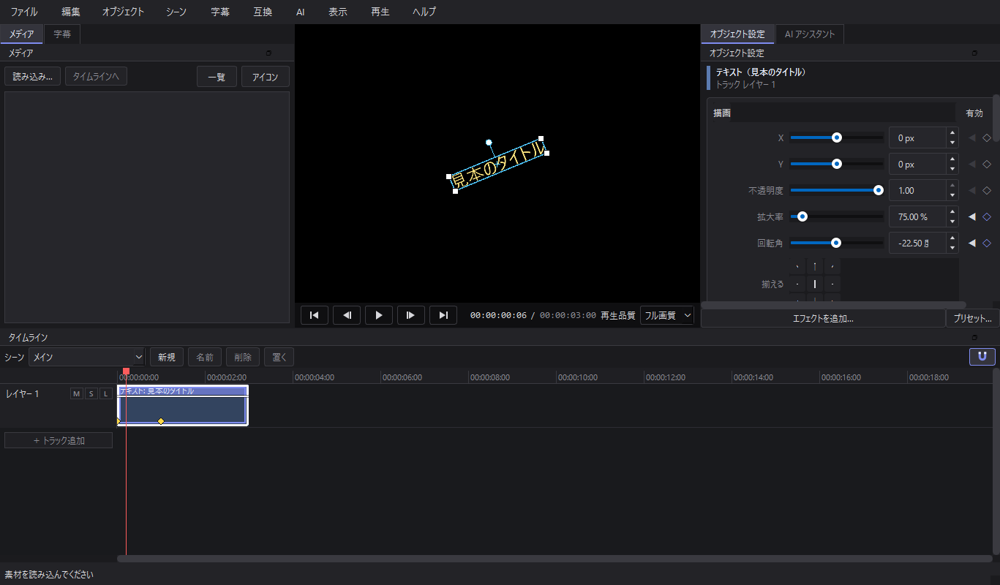

# Sashimono Edit（指物）

[](https://github.com/kagemorikosame/sashimono-edit/actions/workflows/ci.yml) [](LICENSE)

Python 製の動画編集ソフト AviUtl の表現力、Premiere の操作性、AI エージェントによる編集自動化を 1 つにまとめることを目指しています

<br clear="left">

名前は日本の木工技法「指物」から 釘を使わず、木の板を継手と仕口で組み合わせて箱や家具を作る技法です
小さな素材を組み上げて 1 本の動画にすること、そして AviUtl のスクリプトや YMM4 のテンプレートと
自作のものが同じ仕組みに嵌まることの両方を指しています
ロゴの三本の棒は互いに組まれていて、中央の空きが再生の記号になっています

<!-- 旧名を残す: ここから（名前の一括置換でも書き換えない 旧名を案内する所） -->
> **旧名は Kumiki（組木）です** 商標の都合で Sashimono Edit に改名しました
> 中身は同じソフトで、改名前のものはそのまま引き継げます
>
> - 改名前に保存したプロジェクト（`.kmk`）とプリセット（`.kmkp`）はそのまま開けます 保存すると新しい形式で書きます
> - 設定・ショートカット・プリセット・自分で置いたスクリプトとテンプレート（`%APPDATA%\Kumiki`）は、
>   新しい版を初めて起動したときに `%APPDATA%\Sashimono` へ写します 元のフォルダは残します
> - 退避・バックアップ・キャッシュ・導入した字幕起こしなど（`%LOCALAPPDATA%\Kumiki`）は
>   `%LOCALAPPDATA%\Sashimono` へ移します 前の版が動いていて丸ごとは移せないときは、
>   退避とバックアップだけを 1 つずつ移し（前の版を閉じた後の起動でも続けて拾います）、
>   キャッシュは作り直し、字幕起こしなどは入れ直しになります 前の版を閉じてから起動してください
> - 配布版の zip は `SashimonoEdit-<版>-windows-x64.zip`、exe は `Sashimono.exe` になりました
>   前の版の `Kumiki.exe` の隣の `scripts` フォルダに置いた物は、新しい版からは読まれず、
>   自動でも移しません 〔互換〕→〔スクリプトフォルダを開く〕で開く `%APPDATA%\Sashimono\scripts` へ移してください
>   （`Sashimono.exe` の隣の `scripts` に置いた物は、新しい版が起動したときに `%APPDATA%` 側へ移します）
> - GitHub の置き場も `kagemorikosame/sashimono-edit` へ移りました 前の URL は転送されます
<!-- 旧名を残す: ここまで -->



## 現状

**P6（YMM4 互換）まで完成** 素材の読み込みからカット編集、エフェクト、字幕、AI への指示、AviUtl スクリプトの実行、配布テンプレートの適用、書き出しまでが一本通る

- 素材の読み込み（D&D / メニュー）と、映像・音声のリンクした自動配置
- タイムライン: 動画サムネイル・音声波形の表示、拡大縮小、スクラブ
- カット編集: 分割（S）、削除（Del）、詰めて削除（Shift+Del）、ドラッグ移動、端のトリム
- GPU 合成によるプレビュー（リニア空間、再生品質の切り替え）
- 音声再生（オーディオを時計にした A/V 同期）
- NVENC / CPU での書き出し
- プロジェクトの保存・読み込み（`.sme`）と Undo / Redo
- エフェクト 105 種（映像 99 種・音 6 種） 標準の物（色調補正・ぼかし・方向ぼかし・グロー・クロマキー・輝度キー・変形・クリッピング・縁取り・影・グラデーション・単色塗り・不透明度・シャープ・ノイズ・モザイク・マスク ほか）に、YMM4 の配布物と本体の絵に合わせた動き（ランダム・反復・登場と退場・跳ねる・渦巻き・波・破片・残像・パーティクル ほか）と加工（模様で塗る・縁の反射・内側の影と縁取り・網点・グリッチ・長い影・魚眼・波紋・極座標・引き伸ばし・レンズぼかし・エンボス ほか）、音の調整（音量・フェード・ディレイ・リバーブ・音程 ほか）
- 合成モード 26 種（通常・加算・減算・乗算・スクリーン・オーバーレイ・ソフトライト・焼き込み・比較(明)(暗)・差の絶対値・色相・輝度 ほか）と、板を傾ける X 軸・Y 軸の回転
- 場面切り替え（前の場面と後の場面を切り替え・クロスフェード・押し出し・スライド・重ねるで混ぜる 前後それぞれにエフェクトを積める）
- シーン（別のタイムラインを 1 本のクリップとして入れ子に置く）と、クリップのグループ（束ねてまとめて選ぶ・動かす）
- キーフレームアニメーションとグラフエディタ（直線・曲線・加減速・瞬間移動）
- テキストと図形オブジェクト（縁取り・影・行揃え・縦の基準・縦書き・文字送り・時間を数えるタイマー、13 種の図形）
- パラメータ定義から自動生成される設定 UI
- エフェクト構成のプリセット保存（`.smep`）
- 字幕起こし（faster-whisper）、フィラー語の除去と改行整形、無音カット、SRT / VTT / テキスト書き出し、タイムラインへの焼き込み
- ソフト内の AI アシスタント 話しかけると実際に編集し、結果を自分で見て確認する
- AviUtl のスクリプト実行（Lua 5.1）と、`.exo` / `.exa` / `.object` の読み込み
- 配布テンプレートの棚 AviUtl2 のエイリアスと YMM4 のアイテムテンプレート（`.ymmt`）を並べ、
  タイムラインへ置くか、**今ある字幕に見た目だけ着せる**

未着手: P7（プロキシ・バックグラウンドレンダ・GPU 最適化・プラグイン SDK・パッケージング）

### エフェクトの定義について

パラメータの仕様は AviUtl のスクリプト制御文字（`--track@` `--check@` `--color@` など）と
1 対 1 に対応させてあります 自前のエフェクトも配布スクリプトも同じ定義形式に載るので、
設定 UI の自動生成もプリセットの保存も 1 つの実装で済みます

## 字幕



字幕は**トラックではなく素材に紐付きます** タイムライン上のどこに出るかは、その素材を
参照しているクリップごとに毎回計算する（投影する）ので、カット・分割・移動・速度変更の
どれをしても字幕はずれません 追従処理を書いていないのではなく、**位置を持たせないので
ずれようがない**という作りです

| やること | どうなるか |
|---|---|
| 起こす | 素材の音声を認識して、素材に字幕を持たせる |
| 整形する | 「えーと」などのフィラー語を落とし、句読点と改行位置を整える |
| 無音カット | 波形の無音区間を検出し、タイムラインからまとめて削って詰める（1 回の Undo で戻せる） |
| 焼き込み | いま画面に出ている字幕を、テキストオブジェクトとしてタイムラインへ並べる |
| 書き出し | SRT / WebVTT / 素のテキスト 時刻は編集後のタイムライン基準 |

無音カットは、起こし結果がある場合「文字を起こせている区間は切らない」を選べます
波形だけでは小さな声と環境音を区別できないので、これを入れるとしきい値を強気にできます

### 起こしの実行環境は、初期状態では入っていません

音声認識の依存（faster-whisper と CUDA ランタイム）は合計で 2 GB を超えます 字幕を使わない
人にまで配布サイズを負担させたくないので、**既定では同梱せず、必要になった時点でソフト内から
導入する**方針です

字幕パネルの「起こす…」を開くと、未導入なら「環境を導入」ボタンが出ます 押すと入るものと
実行するコマンドを表示してから `pip` を子プロセスで走らせ、その出力をそのまま画面に流します
GPU を使わない選択もでき、その場合は CUDA ランタイム（約 1.7 GB）を落とさずに済みます

導入せずに使える範囲:

- すでにある字幕の編集・整形・分割・結合
- 無音カット（波形だけで動きます）
- 字幕ファイルの書き出しと焼き込み

自分で入れる場合は次のとおりです ソフト内のボタンはこれと同じことをします

```bash
.venv\Scripts\python.exe -m pip install -e ".[asr]"
```

パッケージ版（PyInstaller）では実行ファイルの中へは書き込めないので、
`%LOCALAPPDATA%\Sashimono\runtime` へ入れ、起動時にそのフォルダを import パスへ足します

## AI アシスタント



編集画面の中で Claude と話し、**実際の編集操作をさせられます** 「冒頭 1 秒を切って」
「画面下に黄色いテロップを 3 秒入れて」のように書くと、その場でタイムラインが変わります
（上の写真の会話は撮る道具が並べた見本で、Claude には送っていません タイムラインは
会話のとおりに組んであります）

仕組みは MCP です 編集操作をアプリ内の MCP サーバとして公開し、Claude Agent SDK 経由で
繋いでいます 外部プロセスにしていないのは、編集中のプロジェクトがメモリ上にしか無いため
ファイル越しに渡すと、保存していない状態を触れなくなります

**AI は自分の編集結果を見られます** `preview_frame` を呼ぶとその位置を GPU で合成して
画像で返すので、「値は合っているが見た目が違う」に気付けます これが無いと当てずっぽうに
なります 描く前に再生は止まります

安全のための決まりごと:

| 決まり | 中身 |
|---|---|
| 1 指示 = 1 取り消し | AI が何十回操作しても、Undo 1 回で指示の前に戻ります |
| 変更には確認 | 読み取りは自由、タイムラインを変える操作は許可を求めます（自動承認も選べます） |
| 使えるのは編集操作だけ | ファイル読み書き・シェル・Web は全部止めてあります |
| 中断できる | 生成中でも確認待ちでも、中断ボタンで畳めます |

AI に見せている操作は 43 種類（読み取り 15 / 変更 28）で、UI と同じ `Command` を通ります
シーンを開けば、AI の読み取りと編集もそのシーンのタイムラインが相手になります
UI からできて AI からできない、その逆、が生まれない作りです

### こちらも初期状態では未導入です

Claude Agent SDK が要ります 実行に使う **Claude Code 本体は SDK に同梱**されていて
（合わせて約 250 MB）、字幕起こしと同じく AI パネルの「環境を導入」だけで揃います
導入のあと、再起動しなくてもそのまま使えます

使うには Claude へのログインが要ります AI パネルの「ログイン…」で Claude Code が
別の窓で開くので、案内に従ってログインしてください API キーを使う場合は、環境変数
`ANTHROPIC_API_KEY` を設定してからソフトを起動します

パネルの上でモデル（Claude Opus 5.5 / Sonnet 5 / Haiku 4.5 / Fable 5.1）と考える深さを
選べます 既定は Claude Code に任せます 指示は Enter で送り、Shift+Enter で改行します
（`表示 → 設定…` で Ctrl+Enter で送る形にも戻せます）

自分で入れる場合は次のとおりです

```bash
.venv\Scripts\python.exe -m pip install -e ".[ai]"
```


## AviUtl 互換



AviUtl のアニメーション効果（`.anm` / `.anm2`）をそのまま実行できます 上の画面の
「ゆらゆら」は Lua スクリプトで、**設定欄のコードは 1 行も書いていません**
スクリプトの先頭にある制御文字から自動で組み立てています

```
--track0:振れ幅,0,500,40,1
--track1:速さ,0.1,10,2,0.1
--check0:横に揺れる,0
```

この 3 行が、そのまま右のパネルのスライダーとチェックボックスになります
（写真に写っているのは、撮る道具がその場で作る見本のスクリプトです
配布スクリプトは再配布の条件が作者ごとに違うので、リポジトリには入れていません）
P2 で
パラメータ定義を AviUtl の制御文字と 1 対 1 に対応させておいたので、設定 UI も
プリセットもキーフレームも自前のエフェクトとまったく同じ経路に乗ります

### 実行環境

**Lua は最初から入っています**（`lupa`） 字幕起こしや AI 連携と違い、追加導入は
要りません 互換機能の土台なので、既定が「スクリプトが動かない状態」では意味が
ないためです

使うのは **Lua 5.1** AviUtl 本体と同じで、配布スクリプトが普通に使う `unpack` や
`setfenv` がそのまま動きます

### できること

| | |
|---|---|
| スクリプト実行 | `.anm` `.obj` `.scn` `.cam` `.tra` と AviUtl2 世代の `2` 付き |
| 制御文字 | `--track` `--check` `--color` `--file` `--font` `--text` `--select` `--value` `--figure` `--dialog`（`/chk` `/col` `/fig`）`--param` `--label` |
| `obj` API | 座標・回転・拡大・不透明度・アスペクト・軸ごとの倍率、`draw` `effect` `load` `mes` `setfont` `copybuffer` `getpixel` `putpixel` `getvalue` `getoption` `rand` `interpolation` `module` ほか |
| 補助関数 | `RGB` `HSV` `OR` `AND` `XOR` `SHIFT` `require` `debug_print` |
| オブジェクト | `.exo` / `.exa` の読み込み（テキスト・図形・フィルタ・描画設定・レイヤー） |
| 文字コード | Shift_JIS と UTF-8 を中身から自動判別 |

スクリプトは `%APPDATA%\Sashimono\scripts` に置きます（配布版の `Sashimono.exe` の隣の `scripts` の
扱いは「[更新と、自分の物の置き場](#更新と自分の物の置き場)」） AviUtl2 が入っていれば
`%PROGRAMDATA%\aviutl2\Script` も自動で見に行くので、**手元の資産をコピーせずに
そのまま使えます**

### 安全のための決まりごと

配布スクリプトは他人が書いたコードで、読み込むだけで実行されます

- `io` `os` 素の `require` `dofile` を外し、ファイルにもプロセスにも触れません
- `obj.module` と `require` はスクリプトフォルダの中だけを探します
- 実行の命令数に上限があります 無限ループを書いたスクリプトを掴んでも、
  編集画面は固まらず、そのオブジェクトだけ素通しで出ます

### 動かないものは一覧で分かります

`obj` API は広く、全部を一度に実装することはできません 大事なのは「動かない」
ことではなく**何が足りないかが分かること**なので、未対応の関数が呼ばれたら
落とさずに記録します 〔互換〕→〔互換性レポート…〕に、使われた回数つきで並びます

現時点で分かっている大きな穴:

- `obj.getpixeldata` / `putpixeldata`（画像全体の生データ）
- **native モジュール（`.mod2` の中身が DLL のもの）** — AviUtl2 の Lua に合わせて
  作られた実行ファイルなので、こちらでは動かせません 読み込もうとしたことは
  記録に残ります

手元にあった実配布スクリプト 11 本のうち 8 本が実行できました 残り 3 本は
すべて native モジュールを要求するものです

`obj.drawpoly`（任意の四角形へ貼る）、`obj.rx` `obj.ry` `obj.oz`（板を傾ける・奥へ置く）、
テキスト欄に埋め込んだ Lua（`<?mes(…)?>`）、合成モードの オーバーレイ・比較(明)・比較(暗)・減算 も
効きます

## テンプレート（AviUtl2 エイリアス / YMM4）



〔互換〕→〔テンプレート…〕（Ctrl+Shift+D）で開きます 集めてくるのは 2 種類です

- AviUtl のエイリアス — `%PROGRAMDATA%\aviutl2\Alias` にある `.exa` `.exa2` `.object`
- YMM4 のアイテムテンプレート — `%LOCALAPPDATA%\YukkuriMovieMaker\ItemTemplate` の `.ymmt`

自分で追加するものは `%APPDATA%\Sashimono\templates` に置いてください

選んだテンプレートで写せなかった所は、右下の一覧に出ます その下の〔内容をコピー〕で、
版・名前・一覧の行を互換の報告に貼れる形で写せます テンプレートの中身は入らず、
ホームや設定の置き場は伏せてあります

### 「置く」と「着せる」

配布されている字幕デザインは、見本の文字（`字幕テキスト` など）が入った
テキストオブジェクトとして配られています そのまま置くと毎回打ち直すことに
なるので、使い方を 2 通り用意しました

- **タイムラインへ置く** — 見本の文字ごと再生位置へ置く 新しくテロップを作るとき
- **選択中のクリップに適用** — 今の文字と長さはそのままに、**見た目だけ**入れ替える

後者が本命です すでに打ってある字幕（起こした字幕も含む）を選んでから適用すると、
フォント・サイズ・色・装飾・積まれているエフェクトだけが入れ替わります
テンプレートが持たない項目（フォントのスタイル・折り返しの幅など）は既定に戻るので、
前に何を着ていても棚の見本と同じ見た目になります 折り返しの幅だけは
`表示 → 設定…` の「テンプレートを着せ替えても、テキストの折り返しの幅を残す」で残せます
どちらも 1 回の操作なので、Undo 1 回で元に戻ります



上の画面の文字は自分で打ったもので、金色のグラデーションと縁取りは
見本のエイリアス `見本の金文字.object` から来ています 位置（画面の中央から 380px 下）も
エイリアスの指定どおりです（棚とこの画面に写っているテンプレートは、写真を撮る道具が
その場で書いた見本です 配布物は再配布の条件が作者ごとに違うので写していません）

### AviUtl2 世代の書き方

`.object` は AviUtl1 の `.exa` とは別物で、読み方が 4 か所違います

| | AviUtl1（`.exa`） | AviUtl2（`.object`） |
|---|---|---|
| 節の名前 | `[0]` `[0.1]` | `[Object]` `[Object.1]` |
| 要素の名前 | `_name=テキスト` | `effect.name=テキスト` |
| 区間 | `start=1` `end=60`（1 始まり） | `frame=0,179`（0 始まり） |
| テキスト欄 | UTF-16LE の 16 進 | 素のまま（改行は `\n`） |

パラメータ名も日本語になります（`サイズ` `字間` `文字色` `影・縁色` `文字装飾`
`文字揃え`） 合成モードは番号ではなく `通常` `加算` のような表示名です
開始フレームの数え方も違うので、読んだ側で 0 始まりに揃えています

### 文字装飾

AviUtl2 の `文字装飾` と YMM4 の `Decorations` は、呼び名が違うだけで
言っていることは同じ（縁取りと影）なので、1 つの語彙にまとめてあります

| AviUtl2 | YMM4 | 出るもの |
|---|---|---|
| `標準文字` | （なし） | 装飾なし |
| `影付き文字` / `影付き文字（薄）` | `ShadowDecoration` | 影 |
| `縁取り文字` / `（細）` / `（太）` | `BorderDecoration` | 縁取り |

**太さと影のずれは文字サイズに対する割合で持ちます** 固定の画素数にすると、
サイズを変えたときだけ縁の太さが合わなくなるためです YMM4 は装飾を列で持てるので、
一番太い縁取りを文字そのものに載せ、残りは縁取りエフェクトとして外側に積みます

### 手元の配布物で確かめています

このマシンの `%PROGRAMDATA%\aviutl2\Alias` にあった配布エイリアス **36 本すべて**を
読み込み、1080p で描画するところまでテストで通しています
（`tests/compat/test_real_aliases.py` と `tests/test_p6_end_to_end.py`）
テキスト・フォント・装飾・二重の縁取り・グラデーションが再現できています

### YMM4 のアイテムテンプレート



**ネットで配布されている実物で確かめています** 最初は形式を推測して書いて
いましたが、実物は 1 本も読めませんでした 食い違っていたのは次の 4 点で、
どれも中を開けないと分かりません

| | 推測していたもの | 実物 |
|---|---|---|
| 入れ物 | 素の JSON | **ZIP** 中の `catalog.json` が本体 |
| 数 | 1 ファイル 1 本 | **1 ファイルに何本も**（確かめたのは 17 本と 106 本） |
| アニメーション | 値にフレーム番号が付く | **番号は無い** 長さと「中間点」から決まる |
| 文字装飾 | `Decorations` | 実物では空 `Style` と `VideoEffects` の `OutlineEffect` |

とくに 3 つ目は見落としやすく、値の並び順をフレーム番号だと思って読むと
**300 フレームかけて動くはずのものが 2 フレームで終わり**、見た目には
「動かない」になります 正しくは `KeyFrames.Frames` が中間点を表し、
`[0] + 中間点 + [長さ]` が値の並びと 1 対 1 で対応します



上は見本の「回転しながら登場」を置いて、登場の途中（6 フレーム目）で止めたところです
登場は 30 フレームかけますが、Expo のイージングは前半でほとんど動き切るので、
15 フレーム目まで進めるともう止まって見えます −90° から 0° への回転と 0% から 100% への拡大が、
Expo のイージングで効いています（見本は実物と同じ形の `.ymmt` を撮る道具が書いた物です）

### アニメーション効果は「着せる」

YMM4 のアニメーション効果テンプレートは、中身を持たず**エフェクトだけ**を
持っています（`GroupItem` に入っている） 置いても何も映らないので、
選んだクリップに効果を足す形で使います 棚でそういうテンプレートを選ぶと、
〔タイムラインへ置く〕が押せなくなり〔選択中のクリップに適用〕だけが残ります

### 手元で試すには

`tests/fixtures/ymm4` に `.ymmt` を置くと、`tests/compat/test_real_ymm4.py` が
拾って読み込みを検査します 配布物そのものはリポジトリに入れていません
（作者ごとに再配布の条件が違うため）

## 特徴（目標）

- マルチトラックのノンリニア編集と GPU 合成によるリアルタイムプレビュー
- タイムライン上に動画のフィルムストリップと音声波形を表示
- AviUtl / AviUtl2 のスクリプト・エイリアス資産の読み込み（Lua 実行を含む）
- YMM4 のアイテムテンプレートと文字装飾の取り込み
- 素材に紐付く字幕起こし カット・分割・速度変更に自動追従する
- ソフト内で Claude Code と対話し、AI に実際の編集操作をさせられる

## 開発環境

- Windows 11 / Python 3.14
- ffmpeg 8.x が PATH 上にあること
- OpenGL 4.3 以上に対応した GPU

## セットアップ

```bash
python -m venv .venv
.venv\Scripts\python.exe -m pip install -e ".[dev]"
.venv\Scripts\python.exe tools\check_env.py
```

`check_env.py` は OpenGL コンテキスト、PyAV のデコード、NVENC の利用可否、オーディオ出力をまとめて確認します ここが全部通ってから開発に入ってください

## 起動

```bash
.venv\Scripts\python.exe -m sashimono
```

プロジェクトファイルを引数に渡すと、それを開いた状態で起動します

### 主な操作

| 操作 | キー |
|---|---|
| 再生 / 停止 | Space |
| 再生ヘッドで分割（選んだクリップだけ 選んでいなければ再生ヘッドの下の全部） | S |
| 削除 / 詰めて削除 | Del / Shift+Del |
| コピー / 切り取り / 貼り付け（再生ヘッドの位置） | Ctrl+C / Ctrl+X / Ctrl+V |
| 貼り付け（挿入 再生ヘッドから後ろを貼る長さぶん押し出す 押すトラックは設定で選ぶ） | Ctrl+Shift+V |
| コマ送り | ← / → |
| 先頭 / 末尾へ | Home / End |
| 拡大 / 縮小 | Ctrl+ホイール、または Ctrl+= / Ctrl+- |
| 全体を表示 | Shift+Z |
| 拡大率・トラックの高さを変える | スクロールバーのつまみの端をドラッグ |
| トラックの順序を入れ替える | トラック名の所をドラッグ |
| 素材の読み込み | Ctrl+I |
| テキストを追加 | Ctrl+T |
| 図形を追加 | Ctrl+Shift+T |
| グラフエディタ | Ctrl+G |
| 字幕パネル | Ctrl+Shift+U |
| 字幕を起こす | Ctrl+U |
| 字幕を整形 | Ctrl+Shift+F |
| 無音カット | Ctrl+Shift+J |
| AI アシスタント | Ctrl+Shift+A |
| AviUtl オブジェクトを読み込む | Ctrl+Shift+O |
| テンプレート | Ctrl+Shift+D |
| 書き出し | Ctrl+E |
| 使い方を開く（〔ヘルプ〕→〔使い方〕） | F1 |

不具合や要望、使い方の質問は〔ヘルプ〕→〔不具合・要望を送る〕から [Discussions](../../discussions) へ送れます
「不具合の報告」「互換（AviUtl／YMM4）の報告」「要望」「質問」のカテゴリを選ぶと、版や再現手順の欄が出ます
版と置き場は〔ヘルプ〕→〔バージョン情報…〕に出ます Issue は開発者が直す作業を管理する置き場で、報告は Discussions で確かめてから Issue に起こします

## 更新と、自分の物の置き場

配布版（zip）は、新しい版を自分で確かめ、署名と中身を確かめてから、尋ねて入れ替えます
（〔ヘルプ〕→〔更新を確かめる…〕 確かめるか・尋ねるかは〔表示〕→〔設定…〕で変えられます）
自分で置いた物と入れた物は、ほとんどがインストール先の外にあるので、どちらの入れ替え方でも消えません

| 持ち物 | 置き場 | 自動更新 | 手で入れ替える（zip を展開し直す） |
|---|---|---|---|
| 設定・ショートカット・プリセット・スクリプト・テンプレート・エイリアス | `%APPDATA%\Sashimono` | 残る | 残る |
| 退避・バックアップ・キャッシュ・入れた字幕起こしと AI 連携 | `%LOCALAPPDATA%\Sashimono` | 残る | 残る |
| AviUtl2 の `Script` `Alias` とプラグイン | `%PROGRAMDATA%\aviutl2` | 触らない（読むだけ） | 触らない |
| YMM4 のアイテムテンプレート | `%LOCALAPPDATA%\YukkuriMovieMaker\ItemTemplate` | 触らない（読むだけ） | 触らない |
| `Sashimono.exe` の隣の `scripts` に置いた物 | インストール先の中 | 新しい版へ写す | **フォルダごと入れ替えると消える** |

- スクリプトを置くのは `%APPDATA%\Sashimono\scripts`（〔互換〕→〔スクリプトフォルダを開く〕で開きます）
  `Sashimono.exe` の隣の `scripts` も、前の版の案内どおり置いた人のために読み続けます
  ただし手で入れ替えると消えるので、起動したときに `%APPDATA%\Sashimono\scripts` へ移し、
  何をどこへ移したかを 1 度知らせます 移し先に同じ名前で中身の違う物があれば上書きせず、
  同じフォルダの物（一緒に動く配布物）ごと残します
  同じ名前のスクリプトは、前から `%APPDATA%` の側が使われているので、移しても使われる物は変わりません
  移さずに置いておきたい人は、〔表示〕→〔設定…〕で「移すかを尋ねる」か「何もしない」を選べます
- 手で入れ替えるとき（元のフォルダを消して、新しい zip を展開し直すとき）は、その前に
  〔互換〕→〔exe の隣のスクリプトを移す…〕で移してください 元のフォルダへ上書きで展開するだけなら消えません
- Python が上がる版（リリースノートの先頭に書きます）では、入れてある字幕起こしと AI 連携の入れ直しが要ります
  入れてある物は消しません 入れる前の確認に、入れ直す機能と、大きさと時間の目安が出ます

## 開発

```bash
.venv\Scripts\python.exe tools\verify.py
```

この README と Wiki の画面写真は `tools/shots.py` が撮ります 見本の素材・テンプレート・
スクリプトをその場で作り、アプリ自身に窓を写させるので、画面が変わったら 1 つの命令で
撮り直せます（撮り方は [docs/development.md](docs/development.md)）

ruff・mypy・pytest をまとめて走らせます **CI もこれと同じものを走らせる**ので、
手元で通れば CI でも通ります テストは ffmpeg で実素材をその場に生成するので、
バイナリはリポジトリに含まれていません

| | |
|---|---|
| 開発ルール | [docs/development.md](docs/development.md) |
| PR の送り方 | [CONTRIBUTING.md](CONTRIBUTING.md) |
| 不具合・要望・質問 | [Discussions](../../discussions/new/choose) |
| 開発の作業 | [Issue](../../issues)（報告を確かめたあと開発者が起こす） |

PR は**フェーズ単位**で、CodeRabbit・Copilot・Sourcery・Codex の 4 つの AI にレビューを頼みます（頼み方は [docs/development.md](docs/development.md)）

## ライセンス

**ソースコードは MIT License** です（[LICENSE](LICENSE)）

**配る zip は全体として GPL の条件で配ります** zip には Sashimono を動かす部品を一緒に
入れてあり、その中に GPL の部品があるためです

- 書き出しに使う FFmpeg（PyAV の wheel に同梱の物）は、組み込みの表記が
  「LGPL version 3 or later」ですが、同じ wheel に **libx264 と libx265（GPL）** が入っていて、
  CPU での書き出しは libx264 を使います
- Qt / PySide6 は LGPL-3.0 で使います zip はフォルダの形（PyInstaller の onedir）で組み立てて
  あり、Qt の DLL は別のファイルのまま置かれるので、使う人が差し替えられます
- Sashimono 本体の MIT は GPL と両立します 本体のソースは MIT のままです

同梱している部品ごとの使用許諾とソースの入手先は
[THIRD_PARTY_NOTICES.md](THIRD_PARTY_NOTICES.md) にまとめてあります zip の中では
`THIRD_PARTY_NOTICES.txt` と `licenses` フォルダ（GNU の使用許諾の全文と、部品ごとの写し）に
入っています GPL と LGPL の部品（FFmpeg・x264・x265・Qt など）の対応するソースは、zip と
同じ [Release](../../releases) に添付します

## コード署名と個人情報の扱い

配る `Sashimono.exe` のコード署名の方針（署名する物・役割）と、アプリが通信する所の一覧
（更新の確かめ・後から入れる部品の導入・字幕起こしのモデル・AI アシスタント 何を送り、どう切るか）は
[Code signing policy（コード署名の方針）](docs/code-signing-policy.md) にあります
使い方の統計や利用者を見分ける値は集めません

## 色の扱い

いま扱うのは **SDR の sRGB / Rec.709 だけ**です HDR（PQ / HLG）と広色域（Rec.2020・
Display P3 など）は対象外で、今後の課題です そうした素材を読み込んでも、色を正しく
写すことは約束しません

| | |
|---|---|
| 書き出し | H.264・8 ビット（yuv420p） **BT.709・リミテッドレンジ**で変換し、同じ値の色の印（原色・伝達特性・行列 bt709、範囲 tv）を書きます |
| 読み込み | 素材の色の印（行列と範囲）に従います 印の無い素材は、HD 以上を BT.709、SD を BT.601 とみなします |
| HDR・広色域の素材 | 変換せず、SDR として出します（白っぽく褪せて見えます） HDR（PQ / HLG）と BT.2020 の印が付いた素材は、読み込んだときに 1 度だけ知らせ、素材一覧の行にも `HDR（PQ）` などの印を付けます 知らせは〔表示〕→〔設定…〕で切れます |
| 10 ビットの素材 | 8 ビットとして出します |
| 写真の ICC プロファイル | 読みません sRGB とみなします |

詳しくは [docs/development.md](docs/development.md) の「色の範囲」にあります
